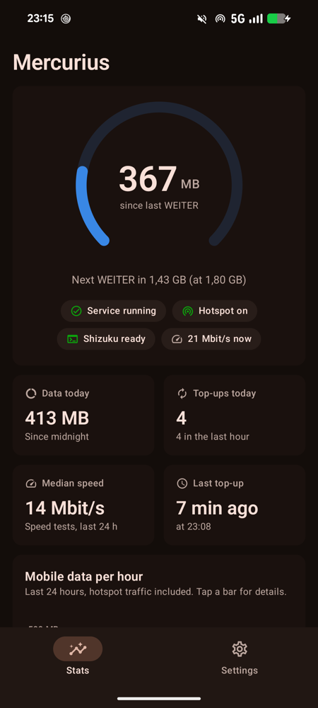
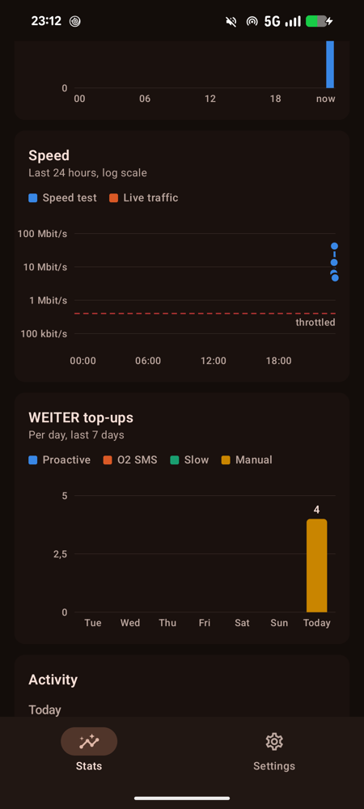
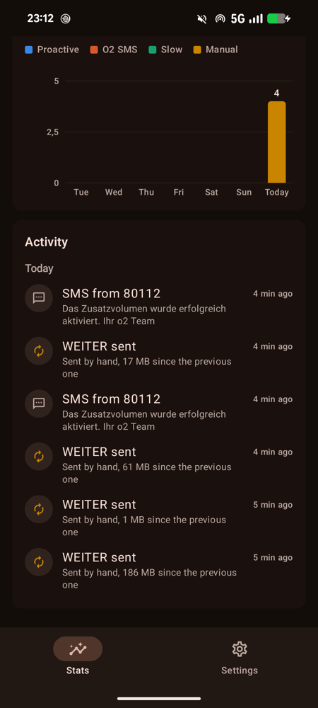
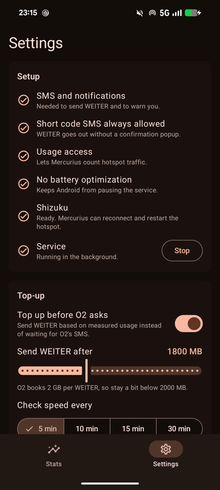
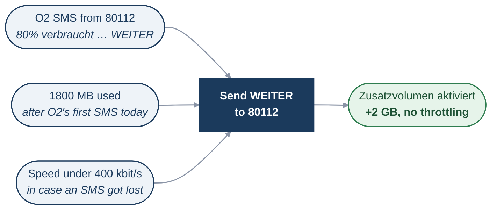
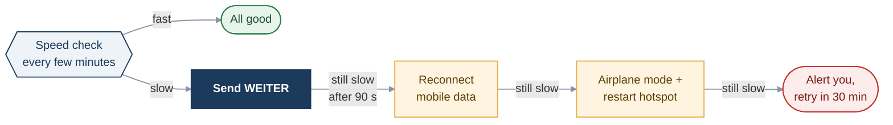
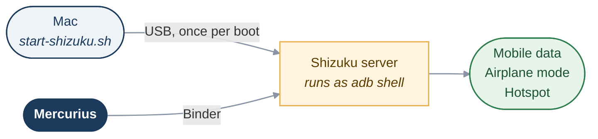

# Mercurius

**Keeps a dedicated Android phone running as a 24/7 home hotspot on O2 "Unlimited On Demand".**

O2's Unlimited On Demand plan hands out data in chunks: when a chunk is used up you have to text `WEITER` to `80112` to get the next one. Fine on a phone in your pocket, useless for a hotspot that serves a whole flat at 3 am. Mercurius sends `WEITER` for you, checks that the speed actually comes back, and repairs the connection and the hotspot when it doesn't.

Named after Mercurius, the Roman god of messengers.

<p align="center">
  
  
  
  
</p>

## How it works

**When Mercurius sends WEITER**



**When the connection is slow**



- **Top-ups**: O2's plan has a daily base volume. Once it is used up, O2 texts from `80112` for every 2 GB chunk: first *"Du hast 80% … verbraucht … mit WEITER antworten"*, then *"… verbraucht. Ab jetzt surfst Du bis zum Ende des Tages mit reduzierter Geschwindigkeit …"*. Mercurius answers the first of these right away, so the connection is never throttled, and switches into on-demand mode until midnight. In on-demand mode it also tops up by measured usage (default every 1800 MB, each `WEITER` adds 2 GB) as a backup in case an SMS gets lost. O2 confirms each one with "Das Zusatzvolumen wurde erfolgreich aktiviert". Only SMS from `80112` count.
- **Speed checks**: measured from live traffic when the line is busy, otherwise with a 500 KB download.
- **Hotspot keeper**: checks the tethering state every minute and turns the hotspot back on through the system `TetheringManager`, the same call the Quick Settings tile makes, so it uses the phone's own hotspot name and password.
- **Safety limits**: at least 90 s between top-ups, at most 20 per hour, one automatic retry when the modem rejects an SMS, and the hotspot is only restarted when its state could be read for certain.
- **Stats**: data per hour, speed history, top-ups per day by reason, and a timeline including O2's replies. Kept for 30 days.

Reconnecting data, airplane mode and the hotspot need shell (adb) rights, which come from [Shizuku](https://shizuku.rikka.app/). Top-ups and speed checks work without it.

## Setup

Requirements: an Android 14+ phone with the O2 SIM, and a Mac with the Android SDK (easiest via Android Studio, or `brew install --cask android-commandlinetools`), adb (`brew install android-platform-tools`) and a JDK 17 or newer. Put `sdk.dir=/Users/<you>/Library/Android/sdk` in `local.properties`.

1. On the phone: enable Developer options and USB debugging, install **Shizuku** from the Play Store and open it once.
2. Connect the phone by USB and run:
   ```sh
   scripts/install.sh        # build, install, grant SMS, usage access and battery exemption
   scripts/start-shizuku.sh  # start Shizuku
   ```
3. In Mercurius > Settings: tap **Allow** for Shizuku, then work through the checklist until everything is green.
4. The first `WEITER` shows Android's "may cause charges" popup for short codes. Tick **Remember my choice** and tap **Send** (or set Settings > Apps > Special app access > Premium SMS access > Mercurius > Always allow). Otherwise every automatic `WEITER` waits for a tap; Mercurius alerts you if that happens.
5. Phone settings: hotspot "Turn off automatically" off, Battery > Charging optimization > Limit to 80%, and ideally no screen lock.

**After every reboot**, run `scripts/start-shizuku.sh` again. Android only lets Shizuku start itself over Wi-Fi, and this phone *is* the Wi-Fi. Until then Mercurius keeps topping up but can't restart the hotspot. With a screen lock, Mercurius also only starts after the first unlock.

## Why Shizuku, and why the Mac

Android deliberately doesn't let normal apps switch mobile data, airplane mode or the hotspot. The **adb shell** user can, because it is meant for developers. [Shizuku](https://shizuku.rikka.app/) is a small app that starts a server on the phone with exactly those shell rights and lets approved apps use it.



- Mercurius binds a small helper class (`ShellService`) into the Shizuku server's shell process and calls it over Binder. That helper runs `svc data`, `cmd connectivity airplane-mode` and `dumpsys tethering`, and starts or stops the hotspot through `TetheringManager` (`TetherControl`).
- Starting the Shizuku server needs adb. Android offers two ways: a USB cable from a computer, or "wireless debugging", which requires the phone to be connected to a Wi-Fi network. This phone *is* the Wi-Fi network, so wireless debugging is out and it has to be USB from the Mac, once after every reboot.
- The server survives until the next reboot, so in daily use the Mac isn't needed.
- Without Shizuku, Mercurius still sends `WEITER` (on O2's SMS, by usage and when slow), runs speed checks and records stats. What stops working until Shizuku is back: reconnecting mobile data, toggling airplane mode, and restarting the hotspot. The Settings checklist shows the Shizuku state.

The Mac is also where the app is built and installed (`scripts/install.sh`), since it isn't distributed through a store.

## Findings from the real device

Tested on a Pixel 8a with Android 17 on O2 Germany:

| Question | Answer |
|---|---|
| Does O2 accept `WEITER` before the chunk is used up? | Yes, confirmed by SMS within 3 s every time. |
| Can the shell user start the hotspot with `cmd wifi start-softap`? | No, it is root-only (`Uid 2000 does not have access`). |
| Can it via `TetheringManager`? | Yes, when the request carries the shell's own package name (otherwise error 14). |
| Does the tethering dump expose a parsable state? | Yes: `wlan1 - TetheredState`. |
| Does sending to a short code need confirmation? | Yes, once. After "Remember my choice" it goes straight out. |
| Does the modem reject SMS sometimes? | Seen once (`IMS_SEND_SMS INVALID_ARGUMENTS`, error 104), hence the retry. |
| Is hotspot traffic counted? | Yes. NetworkStats and TrafficStats agree to the byte, and match the kernel counters of `rmnet1` / `wlan1`. |
| How fast does a flat use data? | Up to about 14 GB per hour, so roughly 8 `WEITER` per hour at the 1800 MB default. |

"Data today" and the hourly chart come from Android's own 1-hour data usage records, so they include traffic from before Mercurius was installed.

## Project layout

```
app/src/main/java/de/jvg/mercurius/
  core/MercuriusService.kt   the loop: counting, top-ups, speed checks, recovery
  core/Network.kt            data counter, speed probe, tethering state and shell commands
  core/TetherControl.kt      hotspot start/stop via TetheringManager (runs as shell)
  core/Shell.kt              Shizuku user service binding
  core/History.kt            30-day event and usage history (JSON)
  ui/stats/                  Stats screen and Canvas charts
  ui/settings/               Settings screen
scripts/                     install and Shizuku start scripts
```

`TetherControl` can be tested without the app, straight from a Mac:

```sh
adb push app/build/outputs/apk/debug/app-debug.apk /data/local/tmp/mercurius.apk
adb shell CLASSPATH=/data/local/tmp/mercurius.apk app_process /system/bin de.jvg.mercurius.core.TetherControl start
```

## License

GPL-3.0, see [LICENSE](LICENSE).
